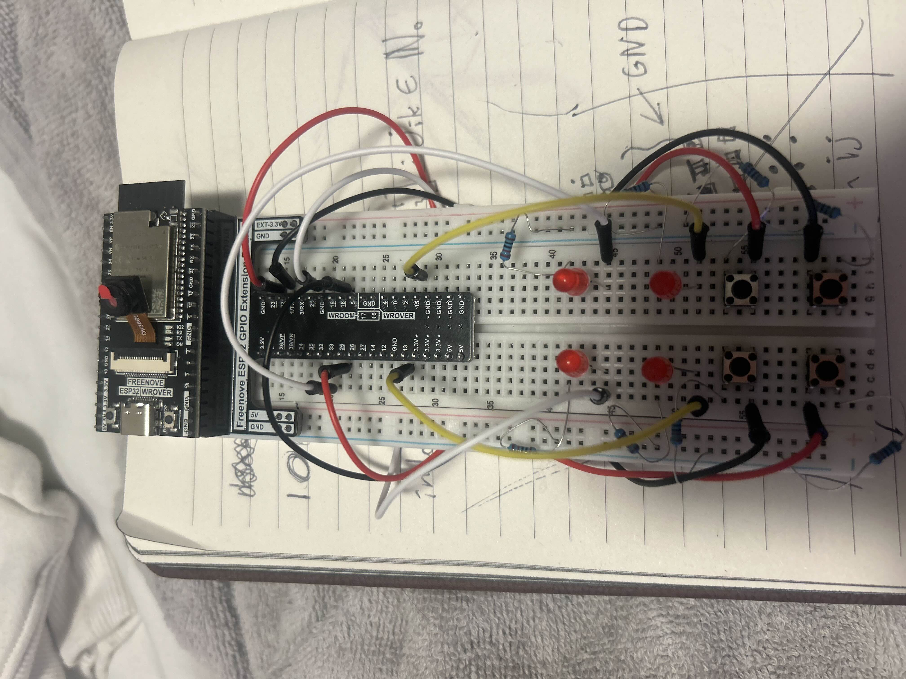

# Description

This project is my take on "the simon game" making use of the [ ESP32-IDF ](https://docs.espressif.com/projects/esp-idf/en/stable/esp32/get-started/index.html) and some simple electronic components to make a reaction time based game

source code found in: **src/main/main.c**

# Breadboard Configuration

bellow you can find attached an image of the breadboard configuration I use. It is possible to use other breadboard configurations to this aslong as there exists a button/LED I/O pair
and the connection between them is appropriately signified

# Building and Running

First you will need to have setup the breadboard(as seen above) and install the ESP32-IDF([instructions here](https://docs.espressif.com/projects/esp-idf/en/stable/esp32/get-started/index.html)).
Secondly, build from the src directory using the following command: **idf.py build flash monitor**
